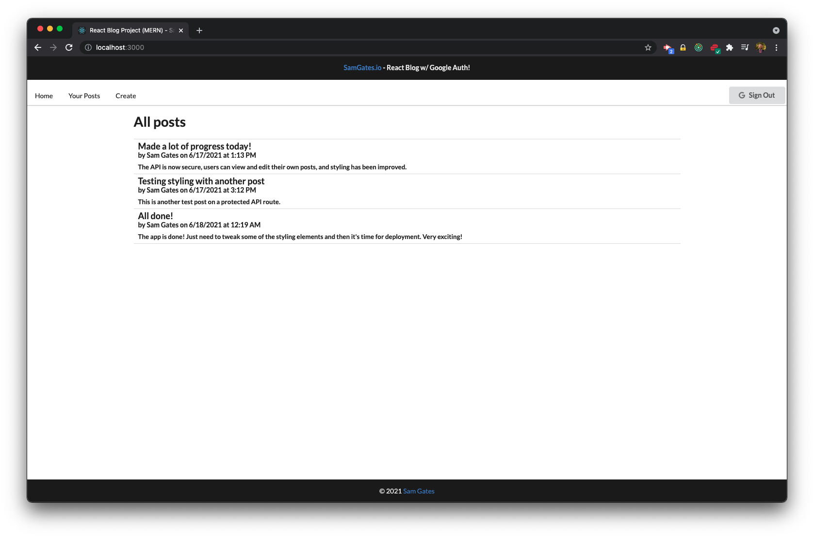
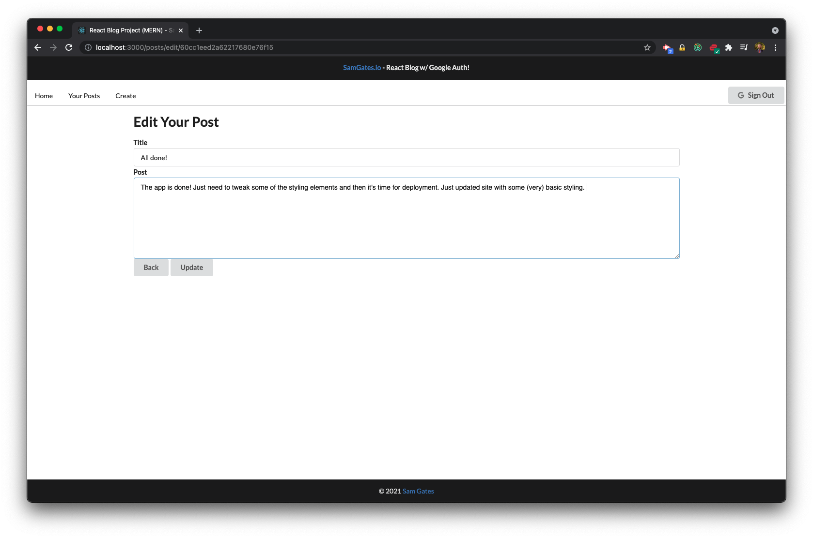

# React Blog (MERN + Redux)

## Description

React Blog is a very basic blog that I am building to practice with the MERN stack and Redux. It will use OAuth to allow Google users to login using their Google credentials. Users can create blog posts that will display to the main page.

There will be a user page where users can see their post history. Users will retain control over their own posts with edit and delete functionality.

This app will use React, React Router, Redux and OAuth for the client side. I am also building the API, which will use Node, Express, and MongoDB Atlas to store data.

## Table of Contents

- [Installation](#installation)
- [Usage](#usage)
- [License](#license)
- [Questions](#questions)

## Installation

The project is currently under development. Keep checking back for updates, and for the announcement when it is complete.

## Usage

At present the app is in development. Once it is launched, users will be able to log in and click "Create" in the navbar. A form will pop up with a title and post field. When the user submits the form, they will be redirected to their own list of posts, which will include the post just submitted.

Users can see their post history and will also see delete and edit buttons next to each post. Users retain control over their content.

The main page will display the most recent posts submitted by users.

## License

Copyright (c) Sam Gates. All rights reserved.
Licensed under the [Apache](https://www.apache.org/licenses/LICENSE-2.0.txt) license.

## Questions

Check out my [GitHub Profile](https://github.com/sg0703) and my [portfolio page](https://samgates.io)!

Email with questions! You can reach me at sam.j.gates@gmail.com.
