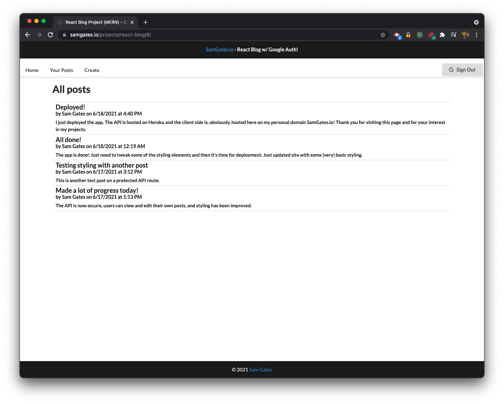
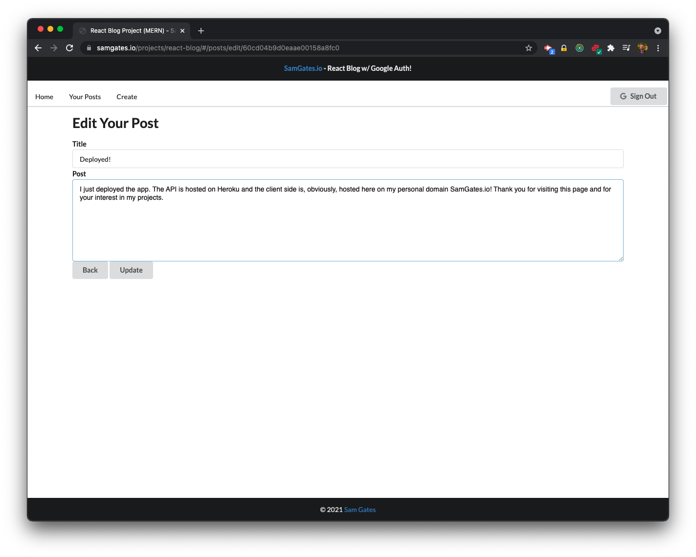

# React Blog (MERN + Redux)

## Description

React Blog is a full stack Mongo, Express, React and Node (MERN) application that allows users to log in with their Google accounts and post blog posts to a communal homepage. The homepage displays the most recent 20 blog posts from all users.

Key API endpoints are secured by using token verification with the Google API Client Library. Some GET routes are intentionally left open and will be documented in the near future.

This app uses the following libraries and services, in addition to the basic MERN stack:

- Redux
- MongoDB Atlas
- Mongoose
- Lodash
- Google API Client Library (Node.js version) [more here](https://developers.google.com/identity/sign-in/web/backend-auth)
- Google Sign-In (OAuth 2.0) [more here](https://developers.google.com/identity/sign-in/web/sign-in)

## Table of Contents

- [Installation](#installation)
- [Usage](#usage)
- [License](#license)
- [Questions](#questions)

## Installation

To try out your own version of this project, download the source code and set up your Mongo server. You can either develop locally or use MongoDB Atlas.

Be sure to install and run both the backend API and the React dev server.

You will need to create a Google Developer account and register in order to get an API key. There is a link above to developer resources for the Google Sign-In API. It's very detailed and helpful, so check it out.

## Usage

Users click the "Sign In" Google button. Once logged in, users can navigate to the "Your Posts" section to view all of their past posts. They can edit and delete their own past posts.

To write a new post, just click "Create"! The app is working and will be deployed shortly. Check back for a link to the deployed project.

## License

Copyright (c) Sam Gates. All rights reserved.
Licensed under the [Apache](https://www.apache.org/licenses/LICENSE-2.0.txt) license.

## Questions

Check out my [GitHub Profile](https://github.com/sg0703) and my [portfolio page](https://samgates.io)!

Email with questions! You can reach me at sam.j.gates@gmail.com.
